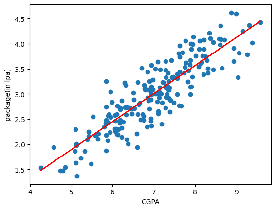

# Simple Linear Regression - Placement Prediction

This project demonstrates a basic implementation of Simple Linear Regression using Python and scikit-learn. The goal is to predict the **placement package (in LPA)** of students based on their **CGPA**.

## 📊 Dataset

The dataset used is `placement.csv`, which contains:
- `cgpa`: Student's CGPA.
- `package`: Placement package offered (in LPA).

Sample:
cgpa, package
6.89, 3.26
5.12, 1.98
7.82, 3.25
...

## 📈 Workflow

1. **Load and Inspect Dataset**
2. **Visualize Data** (scatter plot between CGPA and package)
3. **Split Data** into training and test sets
4. **Train Linear Regression Model**
5. **Predict Placement Package** using test inputs
6. **Visualize Best Fit Line** and predictions

 
## 🧪 Technologies Used

- Python
- Pandas
- NumPy
- Matplotlib
- Scikit-learn

## 🚀 How to Run

1. Clone this repository:
   ```bash
   git clone https://github.com/yourusername/simple-linear-regression.git
   ```
2. Open the Jupyter Notebook:
   ```
   Simple_Linear_Regression.ipynb
   ```
3. Run all the cells to train and test the model.


## 📌 Result

The model learns a linear relationship of the form:


```
package = m * cgpa + b
```

Where `m` is the learned coefficient and `b` is the intercept.



